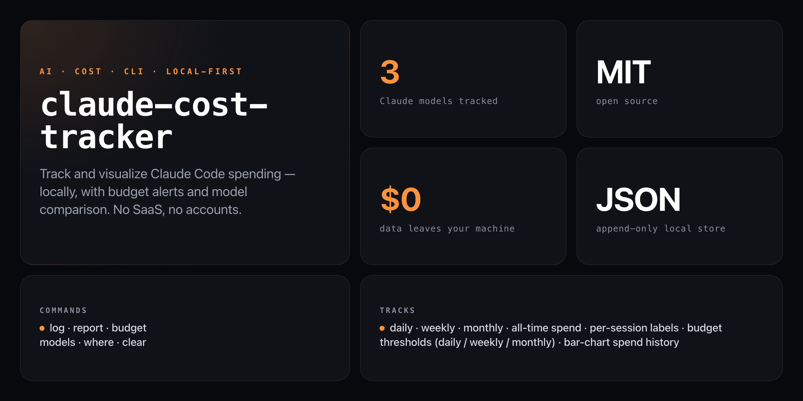

<div align="center">

**Know exactly what your Claude Code sessions cost — before your invoice does.**


</div>

---

Log token usage per session, set daily/weekly/monthly budget alerts, and see a bar-chart breakdown by model — all stored in a local append-only file. No SaaS, no accounts, no telemetry. Data lives in `~/.claude-costs/usage.json` and never leaves your machine.

```
────────────────────────────────────────────────────────────
  Claude Cost Tracker — Report
────────────────────────────────────────────────────────────

  Summary
  Today       $0.1250
  This week   $2.4800
  This month  $8.7200
  All time    $31.4500

  Budget Status
  Today    ████████████░░░░░░░░░░░░  $0.1250 / $5.00 (3%)
  Week     ████████████████████░░░░  $2.4800 / $25.00 (80%)
  Month    ████████░░░░░░░░░░░░░░░░  $8.7200 / $100.00 (9%)

  Daily Spend (last 14 days)
  2026-02-21  █████████████████████████░░░  $1.4600
  2026-02-22  ████░░░░░░░░░░░░░░░░░░░░░░░░  $0.2200
  2026-02-23  ██████████████████████████░░  $1.5200
  2026-02-24  ████████████████████████████  $1.6600

  By Model
  Claude Haiku      ████████░░░░░░░░░░░░  $1.2400   48 calls
  Claude Sonnet     ████████████████████  $5.9800  103 calls
  Claude Opus       █████████░░░░░░░░░░░  $3.4800   12 calls

  Top Sessions
  feature-build         ████████████░░░░░░░░  $2.1200
  code-review           ███████░░░░░░░░░░░░░  $1.2400
```

Bar colors: green = within budget, yellow = approaching (80%+), red = exceeded.

## Install

Runs straight from GitHub — no npm account needed:

```bash
npx github:NickCirv/claude-cost-tracker
```

## Usage

### Log a session

```bash
# Log 50k tokens on Sonnet (80/20 input/output split assumed)
npx github:NickCirv/claude-cost-tracker log --tokens 50000 --model sonnet

# Explicit input/output split
npx github:NickCirv/claude-cost-tracker log --input 40000 --output 10000 --model opus

# Tag a session for grouping in the report
npx github:NickCirv/claude-cost-tracker log --tokens 80000 --model sonnet --session "feature-build"
```

### View report

```bash
npx github:NickCirv/claude-cost-tracker report

# Show last 30 days in the chart
npx github:NickCirv/claude-cost-tracker report --days 30
```

### Set budget alerts

```bash
npx github:NickCirv/claude-cost-tracker budget --daily 5 --weekly 25
npx github:NickCirv/claude-cost-tracker budget --monthly 100
npx github:NickCirv/claude-cost-tracker budget --clear
```

### Compare model costs

```bash
npx github:NickCirv/claude-cost-tracker models
```

### Other

```bash
npx github:NickCirv/claude-cost-tracker where      # path to usage.json
npx github:NickCirv/claude-cost-tracker clear      # wipe all data (prompts for confirmation)
npx github:NickCirv/claude-cost-tracker clear --yes  # skip confirmation
```

## Flag reference

| Command | Flag | Description |
|---------|------|-------------|
| `log` | `--tokens <n>` | Total tokens (80/20 input/output split) |
| `log` | `--input <n>` | Input tokens (overrides `--tokens`) |
| `log` | `--output <n>` | Output tokens (default: 20% of total) |
| `log` | `--model <model>` | **Required.** `haiku`, `sonnet`, or `opus` |
| `log` | `--session <label>` | Optional label to group entries in the report |
| `report` | `--days <n>` | Days to show in the daily chart (default: 14) |
| `budget` | `--daily <amount>` | Daily budget in USD |
| `budget` | `--weekly <amount>` | Weekly budget in USD |
| `budget` | `--monthly <amount>` | Monthly budget in USD |
| `budget` | `--clear` | Remove all budget thresholds |
| `clear` | `--yes` | Skip the confirmation prompt |

Model aliases accepted: `haiku`, `sonnet`, `opus` and common `claude-*` variants (e.g. `claude-sonnet-4`, `claude-opus-4`).

## Cost reference

| Model | Input /1M tokens | Output /1M tokens |
|-------|-----------------|-------------------|
| Claude Haiku | $0.25 | $1.25 |
| Claude Sonnet | $3.00 | $15.00 |
| Claude Opus | $15.00 | $75.00 |

Rates are stored in `src/models.js` — update there when Anthropic changes pricing.

## Data storage

All data lives in `~/.claude-costs/`:

```
~/.claude-costs/
  usage.json    # append-only array of usage entries
  budget.json   # your budget thresholds
```

Each entry in `usage.json`:

```json
{
  "id": "lpt8xz4k",
  "timestamp": "2026-02-27T14:32:11.000Z",
  "model": "sonnet",
  "inputTokens": 40000,
  "outputTokens": 10000,
  "cost": 0.270000,
  "session": "feature-build"
}
```

## What it is NOT

- **Not automatic.** Usage must be logged manually via `log` — it doesn't hook into the Claude Code process or read API responses directly.
- **Not a billing source of truth.** Rates are hardcoded and may drift from Anthropic's live pricing; use for personal budgeting, not invoicing.
- **Not a cloud service.** There is no sync, sharing, or dashboard — it's a local CLI for personal spend awareness.

---

<div align="center">
<sub>Node 18+ · MIT · by <a href="https://github.com/NickCirv">NickCirv</a></sub>
</div>
