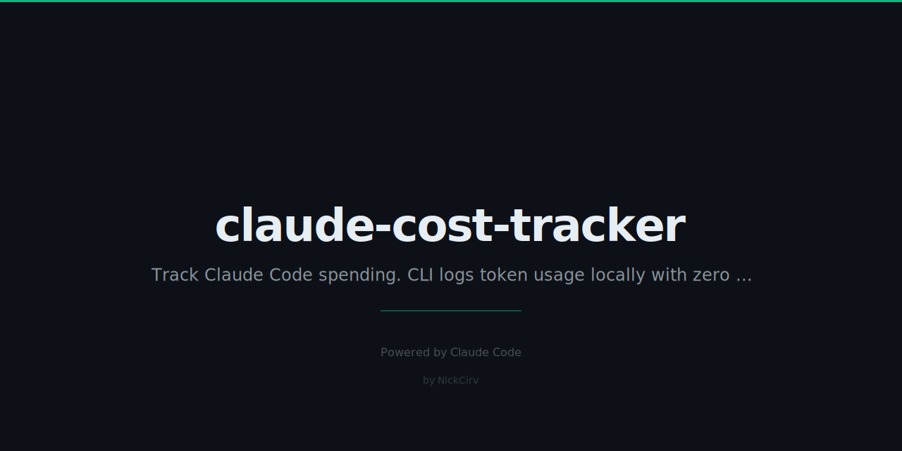

# claude-cost-tracker

Track and visualize Claude Code API spending — local, zero dependencies on external APIs.

Stores data in `~/.claude-costs/usage.json`. No SaaS, no accounts, no telemetry.

## Install

```bash
npm install -g claude-cost-tracker
# or run directly
npx claude-cost-tracker
```

## Commands

### Log usage

```bash
# Log 50k tokens on Sonnet (80% input, 20% output assumed)
npx claude-cost-tracker log --tokens 50000 --model sonnet

# Explicit split
npx claude-cost-tracker log --input 40000 --output 10000 --model opus

# Tag a session
npx claude-cost-tracker log --tokens 80000 --model sonnet --session "feature-build"
```

### View report

```bash
npx claude-cost-tracker report

# Show last 30 days in chart
npx claude-cost-tracker report --days 30
```

### Set budget alerts

```bash
npx claude-cost-tracker budget --daily 5 --weekly 25
npx claude-cost-tracker budget --monthly 100
npx claude-cost-tracker budget --clear
```

### Compare model costs

```bash
npx claude-cost-tracker models
```

### Other

```bash
npx claude-cost-tracker where      # path to usage.json
npx claude-cost-tracker clear      # wipe all data
```

## Example Terminal Output

```
────────────────────────────────────────────────────────────
  Claude Cost Tracker — Report
────────────────────────────────────────────────────────────

  Summary
  Today       $0.1250
  This week   $2.4800
  This month  $8.7200
  All time    $31.4500

  Budget Status
  Today    ████████████░░░░░░░░░░░░  $0.1250 / $5.00 (3%)
  Week     ████████████████████░░░░  $2.4800 / $25.00 (80%)
  Month    ████████░░░░░░░░░░░░░░░░  $8.7200 / $100.00 (9%)

  Daily Spend (last 14 days)
  2026-02-14  ████░░░░░░░░░░░░░░░░░░░░░░░░  $0.2340
  2026-02-15  ░░░░░░░░░░░░░░░░░░░░░░░░░░░░  $0.0000
  2026-02-16  ██████████░░░░░░░░░░░░░░░░░░  $0.5800
  2026-02-17  ███████████████░░░░░░░░░░░░░  $0.8800
  2026-02-18  █████████████████████░░░░░░░  $1.2400
  2026-02-19  ████████░░░░░░░░░░░░░░░░░░░░  $0.4300
  2026-02-20  ██████░░░░░░░░░░░░░░░░░░░░░░  $0.3100
  2026-02-21  █████████████████████████░░░  $1.4600
  2026-02-22  ████░░░░░░░░░░░░░░░░░░░░░░░░  $0.2200
  2026-02-23  ██████████████████████████░░  $1.5200
  2026-02-24  ████████████████████████████  $1.6600
  2026-02-25  ███████████░░░░░░░░░░░░░░░░░  $0.6400
  2026-02-26  █░░░░░░░░░░░░░░░░░░░░░░░░░░░  $0.0800
  2026-02-27  ██░░░░░░░░░░░░░░░░░░░░░░░░░░  $0.1250

  By Model
  Claude Haiku      ████████░░░░░░░░░░░░  $1.2400   48 calls
  Claude Sonnet     ████████████████████  $5.9800  103 calls
  Claude Opus       █████████░░░░░░░░░░░  $3.4800   12 calls

  Top Sessions
  feature-build         ████████████░░░░░░░░  $2.1200
  code-review           ███████░░░░░░░░░░░░░  $1.2400
  morning-briefing      █████░░░░░░░░░░░░░░░  $0.8800
```

Bar colors: green = within budget, yellow = approaching (80%+), red = exceeded.

## Cost Reference

| Model         | Input /1M tokens | Output /1M tokens |
|---------------|-----------------|------------------|
| Claude Haiku  | $0.25           | $1.25            |
| Claude Sonnet | $3.00           | $15.00           |
| Claude Opus   | $15.00          | $75.00           |

Pricing locked in `src/models.js` — update there when Anthropic changes rates.

## Data Storage

All data lives at `~/.claude-costs/`:

```
~/.claude-costs/
  usage.json    # append-only array of usage entries
  budget.json   # your budget thresholds
```

Each entry in `usage.json`:

```json
{
  "id": "lpt8xz4k",
  "timestamp": "2026-02-27T14:32:11.000Z",
  "model": "sonnet",
  "inputTokens": 40000,
  "outputTokens": 10000,
  "cost": 0.270000,
  "session": "feature-build"
}
```

## License

MIT
